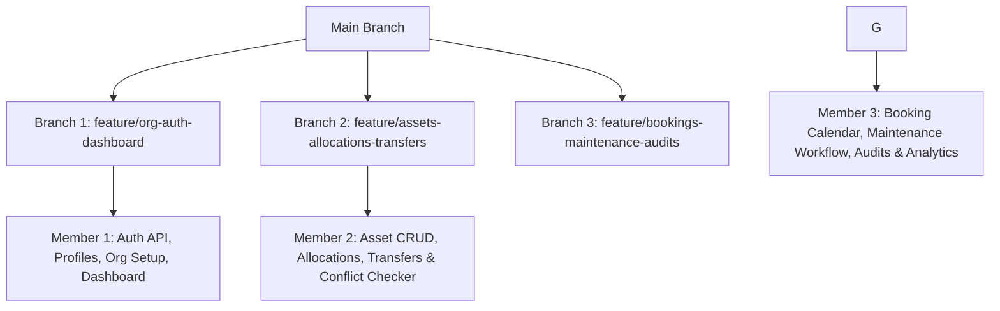

# AssetFlow: Enterprise Asset & Resource Management System (Express + Next.js)

AssetFlow is a centralized enterprise resource planning (ERP) platform designed to simplify and digitize how organizations track, allocate, and maintain their physical assets and shared resources. 

Following a major repository refactor, the project has transitioned to a multi-tier architecture:
1. **Frontend**: Next.js (App Router), Tailwind CSS, and shadcn/ui.
2. **Backend**: Express.js Node server acting as a REST API layer.
3. **Database**: PostgreSQL (via Supabase / direct connection pool in Express).

This document details the updated architecture, route mapping, and the split of work for a team of 3 developers working in parallel on distinct git branches.

---

## User Review Required

Before starting, please align on the following architecture principles:

> [!IMPORTANT]
> **Authentication & JWT validation**
> - The Next.js frontend now authenticates against the Express backend (`/api/auth`).
> - Route protection must be handled both on the client (React layout route guards) and the backend (Express route middleware checking the JWT profile role).
> - Employees signup with the role `employee` by default; Admins promote them to `manager` or `dept_head` via `/api/profiles/promote`.

> [!WARNING]
> **Booking Overlap Prevention (Backend Validation)**
> - Checking timeslot overlap must be validated inside the Express controller `POST /api/bookings` using a transaction to prevent race conditions.
> - SQL check: `SELECT 1 FROM bookings WHERE asset_id = $1 AND status != 'cancelled' AND (start_time, end_time) OVERLAPS ($2, $3)`

---

## Library & Package Versions

To ensure team-wide compatibility and zero dependency conflicts during build time, all developers must pin packages to the following versions.

### Frontend (`frontend/package.json`)
| Package Name | Exact Version | Purpose |
|---|---|---|
| `next` | `14.2.4` | App Router Framework |
| `react` | `^18.3.1` | UI Library |
| `react-dom` | `^18.3.1` | React DOM integration |
| `@supabase/supabase-js` | `^2.43.4` | Auth & DB client interface |
| `zod` | `^3.23.8` | Form schema validations |
| `date-fns` | `^3.6.0` | Date handling & booking calculations |
| `react-day-picker` | `^8.10.1` | Calendar UI engine |
| `react-hook-form` | `^7.51.5` | Form handling state machine |
| `@hookform/resolvers` | `^3.6.0` | Zod form integration |
| `recharts` | `^2.12.7` | Dash & Reports charting visualizations |
| `lucide-react` | `^0.395.0` | UI Icons |
| `tailwindcss` | `^3.4.4` | Base Styling engine |
| `typescript` | `^5.4.5` | Static type checking |

### Backend (`backend/package.json`)
| Package Name | Exact Version | Purpose |
|---|---|---|
| `express` | `^5.2.1` | REST API Router |
| `pg` | `^8.22.0` | PostgreSQL client connection pool |
| `cors` | `^2.8.6` | Cross-Origin Request handler |
| `dotenv` | `^17.4.2` | System env loading |
| `jsonwebtoken` | `^9.0.2` | Authentication token signatures |
| `@types/jsonwebtoken` | `^9.0.6` | TS definitions for JWT signatures |
| `typescript` | `^7.0.2` | Type compiler |
| `ts-node` | `^10.9.2` | Execution compiler |

---

## Technical Architecture & Routes

### Database Schema Map
Located in [backend/db/migrations](file:///c:/Users/MAN%20PATEL/OneDrive/Desktop/Hackathon/Odoo_AssetFlow/Odoo_AssetFlow/backend/db/migrations):
- [profiles](file:///c:/Users/MAN%20PATEL/OneDrive/Desktop/Hackathon/Odoo_AssetFlow/Odoo_AssetFlow/backend/db/migrations/0001_init_enums_and_core_tables.sql): ID references the auth user. Holds role (`admin`, `manager`, `employee`) and department.
- [departments](file:///c:/Users/MAN%20PATEL/OneDrive/Desktop/Hackathon/Odoo_AssetFlow/Odoo_AssetFlow/backend/db/migrations/0001_init_enums_and_core_tables.sql): List of company departments.
- [categories](file:///c:/Users/MAN%20PATEL/OneDrive/Desktop/Hackathon/Odoo_AssetFlow/Odoo_AssetFlow/backend/db/migrations/0002_assets.sql): Asset categories (e.g. Laptops, Vehicles).
- [assets](file:///c:/Users/MAN%20PATEL/OneDrive/Desktop/Hackathon/Odoo_AssetFlow/Odoo_AssetFlow/backend/db/migrations/0002_assets.sql): Inventory items containing `tag` (AF-XXXX), status (`available`, `allocated`, `maintenance`, `lost`, `retired`), location, and a `bookable` boolean flag.
- [allocations](file:///c:/Users/MAN%20PATEL/OneDrive/Desktop/Hackathon/Odoo_AssetFlow/Odoo_AssetFlow/backend/db/migrations/0003_allocations_transfers.sql): Records of asset ownerships.
- [transfers](file:///c:/Users/MAN%20PATEL/OneDrive/Desktop/Hackathon/Odoo_AssetFlow/Odoo_AssetFlow/backend/db/migrations/0003_allocations_transfers.sql): Inter-employee asset handovers.
- [bookings](file:///c:/Users/MAN%20PATEL/OneDrive/Desktop/Hackathon/Odoo_AssetFlow/Odoo_AssetFlow/backend/db/migrations/0004_bookings.sql): Resource calendar schedules.
- [maintenance](file:///c:/Users/MAN%20PATEL/OneDrive/Desktop/Hackathon/Odoo_AssetFlow/Odoo_AssetFlow/backend/db/migrations/0005_maintenance.sql): Asset repair history and workflows.
- [audit_cycles](file:///c:/Users/MAN%20PATEL/OneDrive/Desktop/Hackathon/Odoo_AssetFlow/Odoo_AssetFlow/backend/db/migrations/0006_audit_cycles.sql) & [audit_items](file:///c:/Users/MAN%20PATEL/OneDrive/Desktop/Hackathon/Odoo_AssetFlow/Odoo_AssetFlow/backend/db/migrations/0006_audit_cycles.sql): Audits and discrepancies.

---

### Route Mapping

#### Express REST API Endpoints (Port 5000)

| Endpoint | Method | Purpose | Role Authorization |
|---|---|---|---|
| `/api/auth/signup` | POST | Register an employee (role is hardcoded as `employee`) | Public |
| `/api/auth/login` | POST | Authenticate user and issue JWT | Public |
| `/api/profiles` | GET | List employee directory | All logged-in |
| `/api/profiles/promote` | POST | Promote employee role | Admin Only |
| `/api/departments` | GET/POST/PUT | Create/edit department details and assign head | Admin Only |
| `/api/categories` | GET/POST/PUT | Manage asset categories and attributes | Admin Only |
| `/api/dashboard/kpis` | GET | Retrieve counts for UI dashboard KPIs | All logged-in |
| `/api/assets` | GET/POST | List and search assets / Register new asset | All (POST limited to Admin/Manager) |
| `/api/assets/:id` | GET/PUT/DELETE | View detailed history timeline / update asset | All (PUT/DELETE limited to Admin/Manager) |
| `/api/allocations` | POST | Allocate available asset to staff/department | Admin, Manager, Dept Head |
| `/api/allocations/:id/return` | PUT | Register asset return notes, set state to `available` | Admin, Manager, Dept Head |
| `/api/transfers` | GET/POST | Request peer transfer (conflict check validated) | All logged-in |
| `/api/transfers/:id/approve` | PUT | Approve transfer, update allocation records | Manager or Dept Head |
| `/api/bookings` | GET/POST | View schedules / Create new booking (overlap checks) | All logged-in |
| `/api/maintenance` | GET/POST | View tickets / Raise a repair ticket | All logged-in |
| `/api/maintenance/:id/status` | PUT | Update repair status (approving flips status to maintenance) | Manager Only |
| `/api/audits` | GET/POST | View audits / Initialize a new audit cycle | Admin, Manager |
| `/api/audits/:id/items/:itemId` | PUT | Auditor marks asset as Verified/Missing/Damaged | Assigned Auditor |
| `/api/audits/:id/close` | POST | Lock audit cycle and apply discrepancy states | Admin, Manager |
| `/api/reports/utilization` | GET | Data for asset utilization metrics | Admin, Manager |

#### Next.js Pages (Port 3000)

| Path | Purpose |
|---|---|
| `/login` | Public Login Panel |
| `/signup` | Signup panel |
| `/dashboard` | KPI widgets and overdue return warnings list |
| `/org-setup/departments` | Manage company departments (Admin tabs) |
| `/org-setup/categories` | Manage inventory categories (Admin tabs) |
| `/org-setup/employees` | Staff promotions directory (Admin tabs) |
| `/assets` | Inventory lists, status indicators, query filters |
| `/assets/[id]` | Asset details sheet and activity timeline history |
| `/allocations` | Form to allocate resources or process check-in returns |
| `/bookings` | Scheduler calendar display and reservation forms |
| `/maintenance` | Raise request, manager approval workflows |
| `/audits` | Audit lists and auditor execution panel |
| `/reports` | Usage graphs, heatmaps, CSV reports downloader |

---

## 3-Member Work Split & Branches

---

### Member 1: Org Setup, Auth, Navigation, and Dashboard
* **Git Branch**: `feature/org-auth-dashboard`
* **Focus**: Base Next.js layouts, Express Auth & Session handlers, Admin Org management API endpoints, and Dashboard landing page.

#### Frontend Code changes:
- Initialize shadcn components in `frontend/src/components/ui`: `button`, `input`, `card`, `dialog`, `select`, `tabs`, `table`, `toast`.
- Create sidebar layouts and Topbar containing a notifications bell and current user status.
- Implement `/login`, `/signup`, and `/forgot-password` pages.
- Implement `/org-setup` tab views (departments list, category definitions, and employee promotion dialogs).
- Implement `/dashboard` layout loading KPI cards and overdue alerts list.

#### Backend Code changes:
- Implement `/api/auth/signup`, `/api/auth/login`, `/api/auth/me` endpoints.
- Implement `/api/profiles` and `/api/profiles/promote` endpoints.
- Implement `/api/departments` and `/api/categories` REST handlers.
- Implement `/api/dashboard/kpis` summary endpoint.

---

### Member 2: Core Asset Registration, Allocations, and Transfers
* **Git Branch**: `feature/assets-allocations-transfers`
* **Focus**: Asset inventory tracking, lifecycle state machine, asset allocations to staff, and conflict-checked peer transfers.

#### Frontend Code changes:
- Implement `/assets` directory page (shadcn data-table, search inputs, status indicators).
- Implement Add Asset modal.
- Implement `/assets/[id]` detail view showing detailed attributes sheet and history timeline.
- Implement `/allocations` screen (allocation assignment forms and return note dialogs).
- Implement double allocation check and transfer trigger banner (`"Currently held by Priya. Request Transfer?"`).
- Implement `/allocations/transfers` requests approval inbox.

#### Backend Code changes:
- Implement `/api/assets` endpoints (GET list query filters, POST register new asset, auto-generating tags `AF-XXXX`).
- Implement `/api/assets/:id` handlers (GET detail metrics, PUT update values).
- Implement `/api/allocations` endpoint (POST allocate asset, updates state to `allocated`).
- Implement `/api/allocations/:id/return` endpoint (PUT return notes, updates state to `available`).
- Implement `/api/transfers` handlers (POST request transfer, PUT approve/reject transfer updating database records).

---

### Member 3: Bookings Calendar, Maintenance Workflows, and Audits
* **Git Branch**: `feature/bookings-maintenance-audits`
* **Focus**: Shared resource scheduling, maintenance repair ticketing, structured audit cycles, and reports analytics.

#### Frontend Code changes:
- Implement `/bookings` calendar interface grid showing booked slots.
- Implement Booking form with front-end calendar overlap prevention check.
- Implement `/maintenance` (technician workflow Kanban column board, request repair forms).
- Implement `/audits` lists and `/audits/[id]` auditor item verification lists (Verified, Missing, Damaged buttons).
- Implement `/reports` dashboards showing utilization charts and heatmaps.

#### Backend Code changes:
- Implement `/api/bookings` endpoints (GET list schedules, POST book resource checking for overlapping times).
- Implement `/api/maintenance` endpoints (POST request maintenance, PUT update status changing asset status to `maintenance` or `available`).
- Implement `/api/audits` (POST create audit cycle, GET cycle checklist, PUT update audited item status, POST close audit applying status reconciliation).
- Implement `/api/reports` metrics query endpoints.
